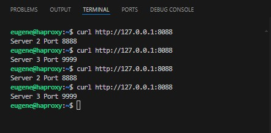

# Домашнее задание к занятию 2 «Кластеризация и балансировка нагрузки»

------


### Задание 1
- Запустите два simple python сервера на своей виртуальной машине на разных портах
- Установите и настройте HAProxy, воспользуйтесь материалами к лекции по [ссылке](2/)
- Настройте балансировку Round-robin на 4 уровне.
- На проверку направьте конфигурационный файл haproxy, скриншоты, где видно перенаправление запросов на разные серверы при обращении к HAProxy.

Часть файла haproxy.cfg, которая отвечает за баланчировку на 4 уровне
  
```
frontend example  # секция фронтенд
        mode tcp
        bind :8088
        default_backend web_servers
        

backend web_servers    # секция бэкенд
        mode tcp
        balance roundrobin
        option httpchk
        http-check send meth GET uri /index.html
        server s2 127.0.0.1:8888 check
        server s3 127.0.0.1:9999 check
```



---

### Задание 2
- Запустите три simple python сервера на своей виртуальной машине на разных портах
- Настройте балансировку Weighted Round Robin на 7 уровне, чтобы первый сервер имел вес 2, второй - 3, а третий - 4
- HAproxy должен балансировать только тот http-трафик, который адресован домену example.local
- На проверку направьте конфигурационный файл haproxy, скриншоты, где видно перенаправление запросов на разные серверы при обращении к HAProxy c использованием домена example.local и без него.

Часть файла haproxy.cfg, которая отвечает за баланчировку на 7 уровне

```
frontend example  # секция фронтенд
        mode http
        bind :8088
        #default_backend web_servers
        acl ACL_example.com hdr(host) -i example.com
        use_backend web_servers if ACL_example.com

backend web_servers    # секция бэкенд
        mode http
        balance roundrobin
        option httpchk
        http-check send meth GET uri /index.html
        server s1 127.0.0.1:7777 weight 2 check
        server s2 127.0.0.1:8888 weight 3 check
        server s3 127.0.0.1:9999 weight 4 check
```


